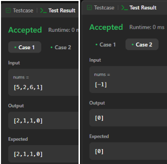
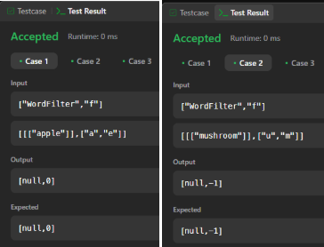
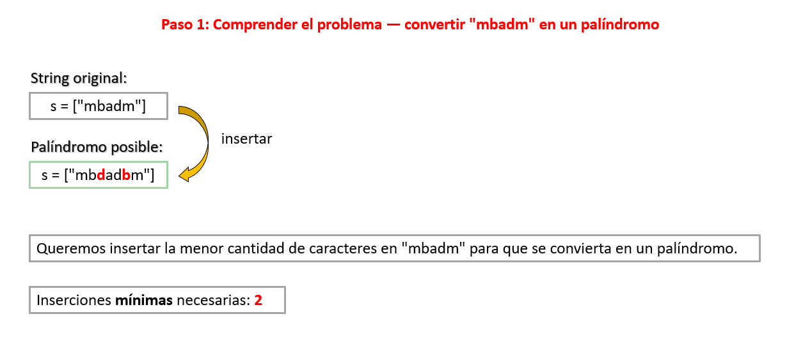
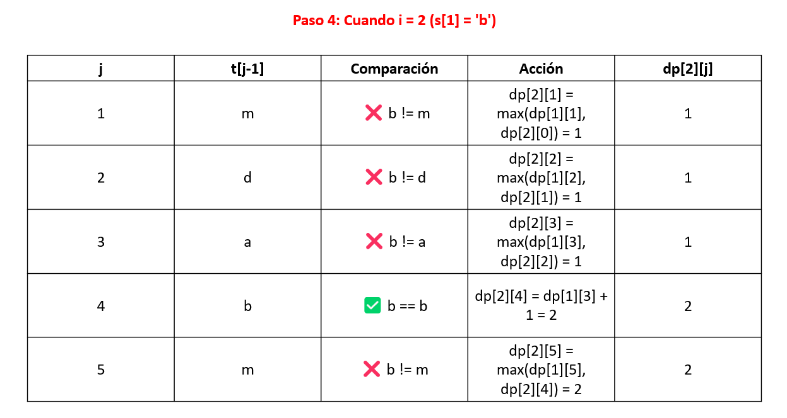
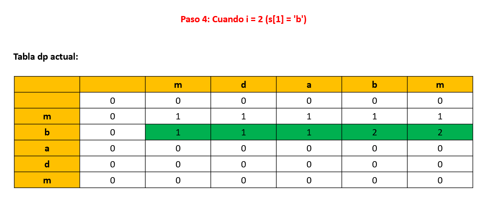
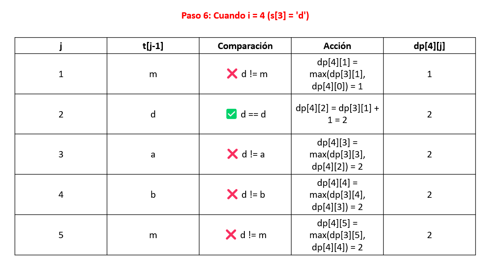
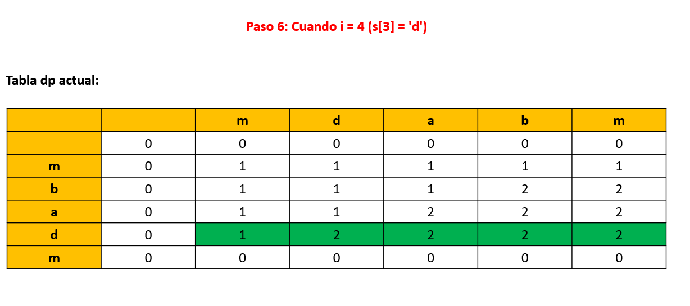
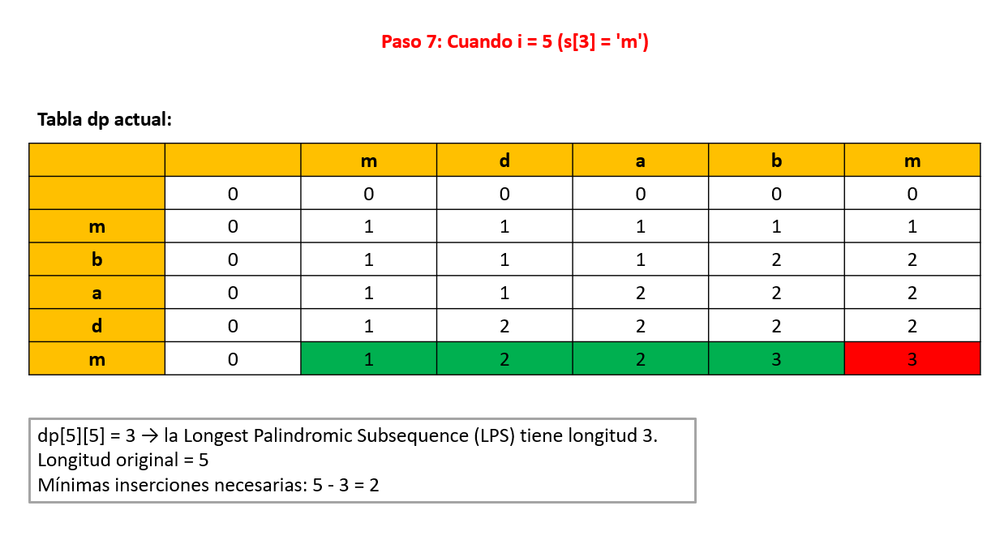

<p align="center">
  
</p>

<h2 align="center">INFORME DEL TRABAJO FINAL</h2>
<h2 align="center">(ABET)</h2>

<h3 align="center">CURSO DE FUNDAMENTOS DE PROGRAMACIÓN COMPETITIVA – CC217</h3>
<h4 align="center">Carrera de Ciencias de la Computación</h4>

<p align="center"><strong>Sección:</strong> 271</p>


<h4 align="center">Alumno:</h4>

<p align="center">
  • Felices Vallejos, Aaron Alvaro <br/>
  • Ibarra Cabrera, Camila Adriana <br/>
  • Rojas Sánchez, Patricia Lucía del Rosario
</p>

<br/>

<p align="center"><strong>Julio 2025</strong></p>
<p style="page-break-after: always;"></p>

---

<h2 align="center"> CONTENIDO</h2>

## 1. Introducción

Es fundamental que, como estudiantes de **Ciencias de la Computación**, no solo se comprenda los conceptos teóricos, sino que, también, se adquiera la capacidad de aplicarlos a problemas reales. Hoy en día, la programación competitiva se ha convertido en una capacidad y habilidad fundamental en el campo laboral y de investigación, en el que se usa la programación como herramienta en la resolución de problemas lógicos y matemáticos, optimizando los rescursos para cumplir satisfactoriamente con condiciones específicas propuestas (Sinza et al., 2023). A través del curso de **Fundamentos de Programación Competitiva**, se enseña técnicas, algoritmos, buenas prácticas y un buen pensamiento computacional a fin de resolver una serie de problemas seleccionados de plataformas como *LeetCode*, *Codeforces* y *Hackerrank*, con el fin de afianzar los aprendizajes adquiridos durante el ciclo.

El principal objetivo del presente trabajo final es *diseñar, implementar y evaluar* soluciones computacionales que abordaran de manera efectiva los requerimientos específicos de los problemas planteados. Mediante el desarrollo de la actividad, se aplicarán los conocimientos técnicos adquiridos durante las sesiones de clase, alineándose con el *Student Outcome 2* del enfoque *ABET*, el cual promueve la *capacidad de aplicar conocimientos en la resolución de problemas reales dentro de sistemas de información*. Para alcanzar este objetivo, se utilizaron estructuras de datos como *árboles y Trie*, y algoritmos avanzados como *KMP, Z y programación dinámica (DP)*, cada uno implementado y documentado detalladamente para asegurar la correcta solución de los problemas y evidenciar el entendimiento de las soluciones aplicadas.

A lo largo del trabajo, los estudiantes consolidaron su dominio sobre herramientas fundamentales en el desarrollo de soluciones algorítmicas eficientes, al tiempo que fortalecieron su capacidad de razonamiento lógico y cuantitativo. Este proceso no solo les permitió enfrentarse a retos de programación de nivel medio y difícil, sino que también contribuyó significativamente al desarrollo de competencias clave en su formación profesional, preparándolos para enfrentar futuros desafíos en el ámbito de la programación competitiva y más allá.

### 1.1 Contexto, objetivo, métodos, conclusiones

En el entorno actual de formación en Ciencias de la Computación, es fundamental que los estudiantes comprendan los conceptos teóricos y sean capaces de aplicarlos en la resolución de problemas reales. La programación competitiva representa un espacio ideal para desarrollar y poner a prueba estas habilidades, ya que plantea desafíos que exigen pensamiento lógico, dominio de estructuras de datos y eficiencia algorítmica. Dentro de este marco, el curso de *Fundamentos de Programación Competitiva* propuso como trabajo final resolver 15 problemas seleccionados de plataformas reconocidas como **LeetCode**, **Codeforces** o **Hackerrank**, con el objetivo de consolidar los aprendizajes adquiridos durante el ciclo.

El objetivo del trabajo fue **diseñar, implementar y evaluar** soluciones computacionales que respondan a requerimientos específicos, alineadas al *Student Outcome 2* del enfoque **ABET**, el cual promueve la capacidad de aplicar el conocimiento técnico en la solución de problemas reales en sistemas de información.

Para lograrlo, se aplicaron distintos métodos y técnicas abordadas durante el curso, como el uso de estructuras como `Segment Tree`, `Trie`, `Map` y algoritmos como `KMP`, `Z` y **programación dinámica**. Cada ejercicio fue documentado con su enunciado, código, validación de resultados y explicación detallada del enfoque adoptado.

Como resultado, se logró consolidar el dominio de herramientas fundamentales para el desarrollo de soluciones algorítmicas eficientes. Además, se fortaleció el razonamiento lógico y cuantitativo de los integrantes del equipo, contribuyendo al desarrollo de competencias clave en su formación profesional.

---

## 2. Objetivo del estudiante

### 2.1 Objetivos

- Aplicar los conocimientos adquiridos durante el curso para resolver problemas de programación competitiva que impliquen el uso de estructuras de datos avanzadas y algoritmos eficientes.  
- Diseñar, implementar y evaluar soluciones computacionales frente a problemas con restricciones reales, en línea con el *Student Outcome 2* del enfoque ABET.  
- Fortalecer la capacidad de análisis, resolución de problemas y toma de decisiones basadas en información cuantitativa, mediante la resolución de casos de nivel *medium* y *hard*.  
- Documentar de forma clara y estructurada el desarrollo de cada algoritmo, explicando su lógica, ejecución y validación, para fomentar una comunicación técnica efectiva.

### 2.2 ¿Cómo se logró el objetivo según el *Student Outcome*?

El trabajo final permitió aplicar de manera directa el *Student Outcome 2*, que establece la capacidad de diseñar, implementar y evaluar soluciones computacionales que cumplan requerimientos en contextos reales.

Para ello, se seleccionaron 15 problemas de dificultad *medium* y *hard* extraídos de plataformas reconocidas como **LeetCode** y **Codeforces**. Cada problema fue analizado a partir de sus restricciones, lo que permitió definir una estrategia de solución adecuada y seleccionar las estructuras de datos o algoritmos más eficientes. Esta etapa corresponde al proceso de **diseño**.

Luego, se procedió a la **implementación** en C++, asegurando el cumplimiento de las condiciones del problema y la correcta ejecución del código en las plataformas correspondientes.  

Finalmente, se llevó a cabo una **evaluación** crítica de cada solución, validando resultados y explicando el porqué de las decisiones tomadas, además de justificar la eficiencia y pertinencia del enfoque elegido. Todo esto fue documentado de forma detallada en el informe.

Gracias a este proceso, se desarrollaron competencias alineadas al *Student Outcome 2*, fortaleciendo la capacidad del equipo para enfrentar retos computacionales complejos con un enfoque estructurado, analítico y eficiente.

---

## 3. Plan de actividades

### 3.1 Actividades para construir los algoritmos

Para cumplir con los objetivos del trabajo final, se siguió una planificación estructurada que permitió avanzar de manera organizada en la resolución de los 15 problemas propuestos. A continuación, se describen las principales actividades realizadas:

- **Selección de problemas:** Se eligieron problemas de nivel *medium* y *hard* de plataformas reconocidas como LeetCode, Codeforces, Hackerrank y GeeksforGeeks, asegurando que cubrieran los tipos de algoritmos definidos por el curso (Map, KMP, Z, Segment Tree, Árbol Fenwick, Árboles Ternarios, Trie y Programación Dinámica).

- **Análisis del enunciado y restricciones:** Para cada problema, se realizó un análisis detallado de los requerimientos y condiciones del enunciado. Esto permitió identificar patrones y definir el enfoque más adecuado para su resolución.

- **Diseño de la solución algorítmica:** Se evaluaron diferentes técnicas posibles para cada caso, eligiendo la que ofreciera un mejor balance entre simplicidad, eficiencia y claridad. En esta etapa se definió la estructura general del código y se diseñaron posibles casos de prueba.

- **Implementación en C++:** Se desarrolló el código utilizando buenas prácticas de programación, haciendo uso de estructuras como vectores, mapas y árboles.

- **Validación en plataforma:** Las soluciones fueron probadas en las plataformas respectivas para verificar su corrección, eficiencia y cumplimiento de las restricciones de tiempo y memoria.

- **Documentación de resultados:** Para cada problema se registraron el enunciado, el código fuente, los datos de entrada y salida, una explicación detallada del algoritmo utilizado y capturas de pantalla que demuestran su validación.

- **Revisión final y ajustes:** Se revisó el trabajo completo, tanto en su forma como en el contenido, realizando correcciones y mejoras para asegurar la coherencia, claridad y calidad del informe.

Esta secuencia de actividades permitió un desarrollo ordenado y efectivo del trabajo final, cumpliendo con los requerimientos establecidos por el curso y alineándose con los resultados de aprendizaje definidos por el enfoque ABET.

---

## 4. Desarrollo

### 4.1 Ejercicios con estructura `map`

#### 4.1.1 Ejercicio 1 - Map

- **Tipo de algoritmo:** Para la resolución de este ejercicio se utiliza la estructura `map`.  
- **Herramienta web:** El problema pertenece a la plataforma LeetCode
- **Enlace:** https://leetcode.com/problems/maximum-sum-queries/ 
- **Enunciado:**  
  
  
  
  
  
  Se te dan dos arreglos de enteros indexados desde 0, `nums1` y `nums2`, cada uno de longitud `n`, y un arreglo 2D indexado desde 1 llamado `queries`, donde `queries[i] = [xi, yi]`.

  Para la *i-ésima* consulta, debes encontrar el valor máximo de `nums1[j] + nums2[j]` entre todos los índices `j` (donde `0 ≤ j < n`) que cumplan `nums1[j] ≥ xi` y `nums2[j] ≥ yi`, o devolver `-1` si no existe ningún `j` que cumpla esas condiciones.

  Debes retornar un arreglo `answer`, donde `answer[i]` es la respuesta a la *i-ésima* consulta.

  

- **Código:**

```cpp
#include <iostream>
#include <vector>
#include <array>
#include <map>
#include <algorithm>
using namespace std;

class Solution {
public:
    vector<int> maximumSumQueries(vector<int>& nums1, vector<int>& nums2, vector<vector<int>>& queries) {
        int n = nums1.size(), m = queries.size();

        vector<array<int, 3>> puntos;
        for (int i = 0; i < n; ++i) {
            puntos.push_back({ nums1[i], nums2[i], nums1[i] + nums2[i] });
        }

        vector<array<int, 3>> consultas;
        for (int i = 0; i < m; ++i) {
            consultas.push_back({ queries[i][0], queries[i][1], i });
        }

        sort(puntos.begin(), puntos.end(), greater<>());
        sort(consultas.begin(), consultas.end(), greater<>());

        map<int, int> mejores;
        vector<int> respuestas(m, -1);
        int pos = 0;

        for (auto& [qx, qy, idx] : consultas) {
            while (pos < n && puntos[pos][0] >= qx) {
                int y = puntos[pos][1];
                int suma = puntos[pos][2];

                auto it = mejores.lower_bound(y);
                if (it != mejores.end() && it->second >= suma) {
                    ++pos;
                    continue;
                }

                mejores[y] = suma;
                ++pos;
            }

            int mejor = -1;
            auto it = mejores.lower_bound(qy);
            while (it != mejores.end()) {
                mejor = max(mejor, it->second);
                ++it;
            }

            respuestas[idx] = mejor;
        }

        return respuestas;
    }
};
```
- **Ingreso y salida de los datos:**
  
  
  - Para `[4, 1]`: el único punto válido es `(4,2)` → `4+2 = 6`  
  - Para `[1, 3]`: el mejor punto es `(1,9)` → `1+9 = 10`  
  - Para `[2, 5]`: el mejor punto es `(2,5)` → `2+5 = 7`  

  Cada resultado representa el mayor `x + y` que cumple las condiciones de la consulta.

- **Verificación del algoritmo y explicación:**

  
  
  El algoritmo recibe dos vectores (`nums1` y `nums2`) y una lista de consultas. Cada consulta busca el valor máximo de `nums1[j] + nums2[j]`, cumpliendo que `nums1[j] ≥ xi` y `nums2[j] ≥ yi`.

  Primero, se combinan los valores de entrada `(x, y, x+y)` en un solo vector de puntos y se ordenan de forma descendente. Las consultas también se ordenan por `x` para facilitar el procesamiento.

  Se utiliza un `map` ordenado para almacenar los mejores puntos (según `y`) que podrían responder futuras consultas. Por cada consulta, se insertan al mapa los puntos válidos y luego se busca, con `lower_bound`, el mejor `x + y` que cumpla con `y ≥ yi`.

  Finalmente, se guarda la mejor suma posible o `-1` si no hay ninguna válida, y se devuelve la lista de respuestas en el orden original de las consultas.

#### 4.1.2 Ejercicio 2 - Map

- **Tipo de algoritmo:** Para la resolución de este ejercicio se utiliza la estructura `map`.  
- **Herramienta web:** El problema pertenece a la plataforma LeetCode
- **Enlace:** https://leetcode.com/problems/arithmetic-subarrays/  
- **Enunciado:**
  
  
  
  Una secuencia de números se denomina aritmética si consiste en al menos dos elementos, y la diferencia entre cada dos elementos consecutivos es la misma. Más formalmente, una secuencia `s` es aritmética si y solo si `s[i+1] - s[i] == s[1] - s[0]` para todo `i` válido.
  
  Por ejemplo, estas son secuencias aritméticas: 
  - 1, 3, 5, 7, 9
  - 7, 7, 7, 7
  - 3, -1, -5, -9
  
  La siguiente secuencia no es aritmética:
  - 1, 1, 2, 5, 7
  
  Se te da un arreglo de **n** enteros, `nums`, y dos arreglos de **m** enteros cada uno, `l` y `r`, que representan las **m** consultas de rango, donde la *i-ésima* consulta es el rango `[l[i], r[i]]`. Todos los arreglos son indexados desde *0*.
  
  Devuelve una lista de elementos booleanos `answer`, donde `answer[i]` es *true* si el subarreglo `nums[l[i]], nums[l[i]+1], ..., nums[r[i]]` puede ser reorganizado para formar una secuencia aritmética, y *false* en caso contrario.

- **Código:**

```cpp
#include <iostream>
#include <map>
#include <vector>
using namespace std;

class Solution {
public:
    vector<bool> checkArithmeticSubarrays(vector<int>& nums, vector<int>& l, vector<int>& r) {

        vector<bool> ans;

		for (int i = 0; i < l.size(); ++i) {
			int start = l[i], end = r[i];

			map<int, int> freq;
			for (int j = start; j <= end; ++j) freq[nums[j]] += 1;
			
			int dif = 0;
			int prev = freq.begin()->first;
			for (auto f : freq) {
				if (f.second == (end - start) + 1) {
					ans.push_back(true);
					break;
				}
				else if (f.second > 1) {
					ans.push_back(false);
					break;
				}
				else {
					if (prev == f.first) continue;
					if (dif == 0) dif = f.first - prev;
					else if (f.first - prev != dif) {
						ans.push_back(false);
						break;
					}
					prev = f.first;
				}
			}

			if (ans.size() < i + 1) ans.push_back(true);
									
		}

		return ans;
    }
};
```

- **Ingreso y salida de los datos:**
  
  
  
  Como ejemplo se tiene que `nums = [4,6,5,9,3,7]`, `l = [0,0,2]` y `r = [2,3,5]`.
  
  - En la primera consulta que toma el rango de `[0, 2]`, el subarreglo es `[4,6,5]` -> **se puede** reorganizar como `[6,5,4]`, que es una *secuencia aritmética*.
  - En la segunda consulta que toma el rango de `[0, 3]`, el subarreglo es `[4,6,5,9]` -> **no se puede** reorganizar como una *secuencia aritmética*.
  - En la tercera consulta que toma el rango de `[2, 5]`, el subarreglo es `[5,9,3,7]` -> **se puede** reorganizar como `[3,5,7,9]`, que es una *secuencia aritmética*.

  Entonces, el vector retornante sería `[true, false, true]`.


- **Verificación del algoritmo y explicación:**

  
  
  El código desarrollado resuelve el problema de determinar si un subarreglo de `nums`, dado por los índices en los arreglos `l` y `r`, se puede reorganizar, de tal modo que forme una secuencia aritmética.
  
  El enfoque principal es el uso de la estructura *map*, que permite contar las frecuencias de los elementos en el subarreglo y, al mismo tiempo, garantiza que los elementos estén ordenados. Esto es importante porque una secuencia aritmética requiere que la diferencia entre los elementos consecutivos sea constante. Algunos casos que se pueden detertar con esta estructura son:

  - Si un número tiene una frecuencia igual al tamaño del rango se inserta *true* en la respuesta, ya que todos los elementos del subarreglo con iguales.
  - Si algún número aparece más de una vez, el subarreglo no puede ser aritmético, y se inserta *false* en la respuesta.
  - A partir del segundo elemento, se calcula la diferencia y se compara que la diferencia de un elemento con el elemento previo de exactamente la diferencia, en caso contrario, se inserta *false* en la respuesta.
  - Si el *map* se recorre sin alguna nueva inserción, significa que la diferencia fue constante, y se inserta *true* en la respuesta.

### 4.2 Ejercicios con algoritmo KMP

#### 4.2.1 Ejercicio 1 - Algoritmo KMP

- **Tipo de algoritmo:** Para la resolución de este ejercicio se utiliza el algoritmo KMP.  
- **Herramienta web:** El problema pertenece a la plataforma LeetCode.  
- **Enlace:** https://leetcode.com/problems/remove-all-occurrences-of-a-substring/  
- **Enunciado:**  

  
  

  Dadas dos cadenas `s` y `part`, realiza la siguiente operación sobre `s` hasta que todas las apariciones de la subcadena `part` sean eliminadas:

  Encuentra la primera aparición (más a la izquierda) de la subcadena `part` y elimínala de `s`.

  Devuelve `s` después de haber eliminado todas las apariciones de `part`.

  Una subcadena es una secuencia continua de caracteres dentro de una cadena.

- **Código:**

```cpp
#include <vector>
#include <iostream>
using namespace std;

class Solution {
public:
    void getLPSArray(string& part, vector<int>& lps) {
        int len = 0, i = 1;
        lps[0] = 0;

        while (i < part.size()) {
            if (part[i] == part[len]) {
                len++;
                lps[i] = len;
                i++;
            } else {
                if (len != 0)
                    len = lps[len - 1];
                else {
                    lps[i] = 0;
                    i++;
                }
            }
        }
    }

    int KMPSearch(string& s, string& part, vector<int>& lps) {
        int i = 0, j = 0;
        while (i < s.size()) {
            if (s[i] == part[j]) {
                i++; j++;
            }

            if (j == part.size())
                return i - j;

            else if (i < s.size() && s[i] != part[j]) {
                if (j != 0) j = lps[j - 1];
                else i++;
            }
        }
        return -1;
    }

    string removeOccurrences(string s, string part) {
        vector<int> lps(part.size());
        getLPSArray(part, lps);

        while (true) {
            int pos = KMPSearch(s, part, lps);
            if (pos == -1) break;
            s.erase(pos, part.size());
        }

        return s;
    }
};
```
- **Ingreso y salida de los datos:**

  
  
  Para la entrada `s = "daabcbaabcbc"` y `part = "abc"`, se eliminan todas las apariciones de `"abc"` de izquierda a derecha.

  El proceso paso a paso es:
  - `"daabcbaabcbc"` → `"dabaabcbc"`
  - `"dabaabcbc"` → `"dababc"`
  - `"dababc"` → `"dab"`

  El resultado final es `"dab"`, ya que no quedan más ocurrencias de `"abc"`.

- **Verificación del algoritmo y explicación:**

  
  
  El algoritmo recibe dos cadenas: `s` (texto) y `part` (patrón a eliminar). El objetivo es eliminar todas las apariciones de `part` dentro de `s`, de forma eficiente.

  Primero, se construye un arreglo `lps` (*longest prefix suffix*) que permite optimizar la búsqueda de coincidencias parciales en el patrón. Este paso evita comparar caracteres repetidos innecesariamente.

  Luego, usando el algoritmo **KMP**, se busca la primera aparición del patrón en la cadena. Si se encuentra, se elimina y el proceso se repite desde el inicio.

  La búsqueda se repite hasta que no quedan más ocurrencias del patrón. Finalmente, se retorna la cadena modificada sin las apariciones de `part`.

#### 4.2.2 Ejercicio 2 - Algoritmo KMP

- **Tipo de algoritmo:** Para la resolución de este ejercicio se utiliza la función LPS (Longest Prefix Suffix) del algoritmo KMP.  
- **Herramienta web:** El problema pertenece a la plataforma LeetCode.  
- **Enlace:** https://leetcode.com/problems/shortest-palindrome/ 
- **Enunciado:**
  
  Dada una cadena de texto `s`. Se pide convertir `s` en un palíndromo añadiendo caracteres al inicio de la cadena.
  
  Se devuelve el palíndromo más corto que puedas encontrar realizando esta transformación.

- **Código:**

```cpp
#include <iostream>
#include <vector>
#include <algorithm>
using namespace std;

void getLPS(string& pat, vector<int>& lps)
{
	int len = 0, i = 1;
	lps[0] = 0;
	int M = pat.size();
	while (i < M)
	{
		if (pat[i] == pat[len])
		{
			len++;
			lps[i] = len;
			i++;
		}
		else
		{
			if (len != 0)
				len = lps[len - 1];
			else
			{
				lps[i] = 0;
				i++;
			}
		}
	}
}

class Solution {
public:
	string shortestPalindrome(string s) {
		if (s.empty()) return s;

		string reversed = s;
		reverse(reversed.begin(), reversed.end());

		string combined = s + "#" + reversed;
		vector<int> lps(combined.size(), 0);
		getLPS(combined, lps);

		int prefix = lps[combined.size() - 1];
		string add = reversed.substr(0, s.size() - prefix);

		return add + s;
	}
};
```
- **Ingreso y salida de los datos:**

  
  
  Para la entrada `s = "aacecaaa"`, se obtiene la palabra en reversa, tal que `reversed = "aaacecaa"`.

  A continuación, se combina ambas palabras, con un símbolo de `#` en medio, para determinar el prefijo y sufijo más largo con la función `LPS`.

  Esta función retorna un vector que contiene la longitud de los sufijos y prefijos de la cadena, de modo que, el último dígito del vector es la longitud del palíndromo central de la palabra. Para el input propuesto se tendría:

  - `a a c e c a a a # a a a c e c a a`
  - `0 1 0 0 0 1 2 2 0 1 2 2 3 4 5 6 7`

  Teniendo como parte central del palíncromo `a a c e c a a` con una longitud de `7`. Entonces, para obtener la parte que no es palíndromo, se extrae de la palabra en reversa los caracteres que no forman parte del palíndromo central, es decir, `8 - 7 = 1` para extraer solo la `a` de la palabra en reversa.

  Se inserta en la palabra original `s`, dando como resultado: `a a a c e c a a a`.

- **Verificación del algoritmo y explicación:**

  
  
  El algoritmo recibe una cadenas `s` (cadena en orden) y se define una cadena `reversed` (cadena en orden inverso de caracteres) para identificar la parte de la cadena original que ya es un palíndromo, en caso la haya.

  Primero, se combina ambas palabras en un `combined = s + # + reversed` para determinar el sufijo de la palabra en reversa que coincida con el prefijo de la cadena original de mayor tamaño.
  
  Para ello, se implementa la función de `lps` (*longest prefix suffix*) ligada al algoritmo KMP. Luego de obtener el vector de longitudes, se selecciona el último digito, que representa al palíndromo de mayor longitud ya existente en la palabra original. Los caracteres que siguen a dicho padríndromo son los que se tienen que sumar.

  Para finalizar, se extrae la longitud de caracteres que faltan de la palabra original de la cadena en reversa, para insertar con facilidad los caracteres invertidos, de modo que se cumpla la condición.

### 4.3 Ejercicios con algoritmo Z

#### 4.3.1 Ejercicio 1 - Algoritmo Z

- **Tipo de algoritmo:** Se utiliza el algoritmo Z.  
- **Herramienta web:** El problema pertenece a la plataforma LeetCode.  
- **Enlace:** https://leetcode.com/problems/longest-happy-prefix/ 
- **Enunciado:**  

  
  
  
  Una cadena se denomina prefijo feliz si es un prefijo no vacío que también es un sufijo (excluyéndose a sí mismo).

  Dada una cadena `s`, devuelve el prefijo feliz más largo de `s`. Devuelve una cadena vacía `""` si no existe dicho prefijo.
    

- **Código:**

```cpp
#include <vector>
#include <string>
using namespace std;


class Solution {
public:
    string longestPrefix(string s) {
        int n = s.size();
        vector<int> Z(n, 0);
        int left = 0, right = 0;
        for (int k = 1; k < n; ++k) {
            if (k > right) {
                left = right = k;
                while (right < n && s[right] == s[right - left]) {
                    right++;
                }
                Z[k] = right - left;
                right--;
            } else {
                int k1 = k - left;
                if (Z[k1] < right - k + 1) {
                    Z[k] = Z[k1];
                } else {
                    left = k;
                    while (right < n && s[right] == s[right - left]) {
                        right++;
                    }
                    Z[k] = right - left;
                    right--;
                }
            }
        }
       
        int max_len = 0;
        for (int i = 1; i < n; ++i) {
            if (Z[i] == n - i) {  
                max_len = max(max_len, Z[i]);
            }
        }
        return s.substr(0, max_len);
    }
};
```
- **Ingreso y salida de los datos:**

  
  
  Para la entrada `s = "ababab"` 

  El proceso paso a paso es:
  - `Array Z: [0,0,2,0,4,0]` 
  - `Z[2] = 2 y n - 2 = 4` → `No cumple`
  - `Z[4] = 4 y n - 4 = 2` → `No cumple`
  - `Z[5] no aplica`
  - `Mejor coincidencia: Z[4] = 4`

  El resultado final es `"abab"`, ya que es el prefijo sufijo más grande.

- **Verificación del algoritmo y explicación:**

  

  `Z[i]` guarda la longitud del substring más largo que empieza en `i` y coincide con el prefijo `s[0...]`. En caso de `left` y `right` tales definen la ventana actual de coincidencia `(s[left...right])`. Si `k > right`, se expande la ventana comparando `s[right]` con `s[right - left]` (prefijo). Si `k` está dentro de la ventana `(k <= right)`, se usa información precalculada para evitar comparaciones redundantes. Para buscar el “happy prefix” se recorre el array `Z` buscando posiciones `i` donde `Z[i]== n-i` (coincidencia hasta el final del string). El máximo de estos valores (max_len) da la longitud del prefijo más largo.
#### 4.3.2 Ejercicio 2 - Algoritmo Z

- **Tipo de algoritmo:** Se utiliza el algoritmo Z.  
- **Herramienta web:** El problema pertenece a la plataforma LeetCode.  
- **Enlace:** https://leetcode.com/problems/sum-of-scores-of-built-strings/description/ 
- **Enunciado:**  

  
  
  

  Se construye una cadena `s` de longitud `n`, carácter por carácter, anteponiendo cada nuevo carácter al principio de la cadena. Las cadenas se etiquetan del `1 al n`, donde la cadena de longitud `i` se etiqueta como `s_i`.

  Por ejemplo, para `s = "abaca"`, `s_1== "a"`, `s_2 == "ca"`, `s_3 == "aca"`, etc.
  La puntuación de `s_i` es la longitud del prefijo común más largo entre `s_i` y `s_n` (tenga en cuenta que `s == s_n`).

  Dada la cadena final `s`, devuelva la suma de las puntuaciones de cada `s_i`.
  

- **Código:**

```cpp
#include <vector>
#include <string>
using namespace std;


class Solution {
public:
    long long sumScores(string s) {
        int n = s.length();
        vector<int> Z(n);
        long long sum = n; 


        int l = 0, r = 0;
        for (int i = 1; i < n; i++) {
            if (i <= r)
                Z[i] = min(r - i + 1, Z[i - l]);
            while (i + Z[i] < n && s[Z[i]] == s[i + Z[i]])
                Z[i]++;
            if (i + Z[i] - 1 > r) {
                l = i;
                r = i + Z[i] - 1;
            }
            sum += Z[i];
        }


        return sum;
    }
};
```
- **Ingreso y salida de los datos:**

  
  
  Para la entrada `s = "babab"` los sufijos son:
 
  - `"babab"` → prefijo común: `"babab"`→ puntaje 5
  - `"abab"`  → prefijo común: `"bab"`  → puntaje 0
  - `"bab"`   → prefijo común: `"bab"`  → puntaje 3
  - `"ab"`    → puntaje 0
  - `"b"`     →  `"b"`  → puntaje 1
  - Suma total: 5 + 0 + 3 + 0 + 1 = 9

  El resultado final es 9

- **Verificación del algoritmo y explicación:**

  

  Nos pide sumar, para cada sufijo de `s`, la longitud del prefijo común que tiene con `s`. 
  Se utiliza el algoritmo Z, que calcula, para cada índice `i`, el largo del prefijo más largo que coincide entre `s[0…]` y `s[i…]`.  Al final, `sum` contiene la suma de todos los `Z[i]`, lo cual es exactamente lo que pide el problema.

### 4.4 Ejercicios con Segment Tree

#### 4.4.1 Ejercicio 1 – Segment Tree

- **Tipo de algoritmo:** Para la resolución de este ejercicio se utiliza la estructura `Segment Tree`.  
- **Herramienta web:** El problema pertenece a la plataforma LeetCode  
- **Enlace:** https://leetcode.com/problems/range-sum-query-mutable/

- **Enunciado:**  

  
  

   Dado un arreglo de enteros `nums`, se deben manejar múltiples consultas de los siguientes tipos:
  - Actualizar el valor de un elemento en `nums`.
  - Calcular la suma de los elementos de `nums` entre los índices `left` y `right` (ambos inclusive), donde `left <= right`.

  Se debe implementar la clase `NumArray` con las siguientes funciones:
  - `NumArray(int[] nums)`: Inicializa el objeto con el arreglo de enteros `nums`.
  - `void update(int index, int val)`: Actualiza el valor de `nums[index]` por `val`.
  - `int sumRange(int left, int right)`: Devuelve la suma de los elementos entre los índices `left` y `right`, inclusive.

- **Código:**

```cpp
#include <iostream>
#include <vector>
using namespace std;

class SegmentTree {
public:
    int n;
    vector<int> tree;

    SegmentTree(int size) {
        n = size;
        tree.assign(4 * n, 0);
    }

    void build(vector<int>& arr, int node = 1, int l = 0, int r = -1) {
        if (r == -1) r = n - 1;
        if (l == r) {
            tree[node] = arr[l];
        } else {
            int mid = (l + r) / 2;
            build(arr, 2 * node, l, mid);
            build(arr, 2 * node + 1, mid + 1, r);
            tree[node] = tree[2 * node] + tree[2 * node + 1];
        }
    }

    void update(int idx, int newValue, int node = 1, int l = 0, int r = -1) {
        if (r == -1) r = n - 1;
        if (l == r) {
            tree[node] = newValue;
        } else {
            int mid = (l + r) / 2;
            if (idx <= mid) {
                update(idx, newValue, 2 * node, l, mid);
            } else {
                update(idx, newValue, 2 * node + 1, mid + 1, r);
            }
            tree[node] = tree[2 * node] + tree[2 * node + 1];
        }
    }

    int query(int ql, int qr, int node = 1, int l = 0, int r = -1) {
        if (r == -1) r = n - 1;
        if (qr < l || ql > r) return 0;
        if (ql <= l && r <= qr) return tree[node];
        int mid = (l + r) / 2;
        return query(ql, qr, 2 * node, l, mid) + query(ql, qr, 2 * node + 1, mid + 1, r);
    }
};

class NumArray {
private:
    SegmentTree st;
public:
    NumArray(vector<int>& nums) : st(nums.size()) {
        st.build(nums);
    }

    void update(int index, int val) {
        st.update(index, val);
    }

    int sumRange(int left, int right) {
        return st.query(left, right);
    }
};
```
- **Ingreso y salida de los datos:**

   
  
  - `NumArray numArray = new NumArray([1, 3, 5]);`  
    Crea el objeto con el arreglo `[1, 3, 5]`.

  - `numArray.sumRange(0, 2);`  
    Devuelve `1 + 3 + 5 = 9`.

  - `numArray.update(1, 2);`  
    Actualiza `nums[1]` de `3` a `2`, por lo que el arreglo queda como `[1, 2, 5]`.

  - `numArray.sumRange(0, 2);`  
    Devuelve `1 + 2 + 5 = 8`.

- **Verificación del algoritmo y explicación:**

  
  
  
  
  

  El algoritmo tiene como objetivo permitir consultas eficientes de suma en rangos y actualizaciones de valores sobre un arreglo de enteros. Para lograrlo, se utiliza un **Segment Tree**, el cual divide el arreglo en segmentos y almacena en cada nodo la suma de un subarreglo determinado.

  Primero, se construye el árbol a partir del arreglo original mediante una función recursiva. Esta función divide el rango actual en mitades y almacena en cada nodo la suma de sus dos hijos. De este modo, se construye una representación jerárquica que permite acceder a la suma de cualquier subarreglo sin necesidad de recorrerlo completamente.

  Cuando se actualiza un valor del arreglo, la función de actualización localiza el nodo correspondiente, modifica el valor y propaga los cambios hacia arriba para mantener las sumas actualizadas. Para responder consultas de suma, el árbol es recorrido selectivamente y solo se suman los nodos que están completamente dentro del rango solicitado. Esto permite obtener el resultado en tiempo logarítmico.

  Al encapsular esta lógica dentro de una clase `NumArray`, se implementan los métodos `update` y `sumRange` requeridos por el problema, garantizando eficiencia incluso ante un gran número de operaciones.

#### 4.4.2 Ejercicio 2 – Segment Tree

- **Tipo de algoritmo:** Para la resolución de este ejercicio se utiliza la estructura `Segment Tree`.  
- **Herramienta web:** El problema pertenece a la plataforma LeetCode  
- **Enlace:** https://leetcode.com/problems/count-of-smaller-numbers-after-self/

- **Enunciado:**  

  
  
  

   Dada una matriz de enteros `nums`, devuelve una matriz de enteros counts donde `counts[i]` es el número de elementos más pequeños a la derecha de `nums[i]`.

- **Código:**

```cpp
#include <vector>
#include <algorithm>
#include <unordered_map>


using namespace std;


class Solution {
private:
    vector<int> tree;
    int size;
    void update(int index, int value) {
        index += size;
        tree[index] += value;
        while (index > 1) {
            index /= 2;
            tree[index] = tree[2 * index] + tree[2 * index + 1];
        }
    }


    int query(int left, int right) {
        left += size;
        right += size;
        int sum = 0;
        while (left <= right) {
            if (left % 2 == 1) {
                sum += tree[left];
                left++;
            }
            if (right % 2 == 0) {
                sum += tree[right];
                right--;
            }
            left /= 2;
            right /= 2;
        }
        return sum;
    }
public:
    vector<int> countSmaller(vector<int>& nums) {
        if (nums.empty()) return {};
        vector<int> sorted_nums = nums;
        sort(sorted_nums.begin(), sorted_nums.end());
        unordered_map<int, int> rank;
        int unique_rank = 0;
        for (int num : sorted_nums) {
            if (rank.find(num) == rank.end()) {
                rank[num] = unique_rank++;
            }
        }
        size = 1;
        while (size < unique_rank) size <<= 1;
        tree.assign(2 * size, 0);
        vector<int> result(nums.size());
        for (int i = nums.size() - 1; i >= 0; --i) {
            int r = rank[nums[i]];
            result[i] = query(0, r - 1);  
            update(r, 1);                
        }
        return result;
    }
};
```
- **Ingreso y salida de los datos:**

   
   
  
  - `nums = [5,2,6,1]` → Salida:  `[2,1,1,0]`
  - Ordenar y eliminar duplicados: `[1, 2, 5, 6]`
  - Asignar rangos (0-indexed): `{1:0, 2:1, 5:2, 6:3}`
  - Se inicializa el segment tree y se recorre : `nums = [5,2,6,1]`
  - Se realizan iteraciones : `nums = [5,2,6,1]`
  - Iteración 1 (i = 3, num = 1): `[?, ?, ?, 0]`
  - Iteración 2 (i = 2, num = 6): `[?, ?, 1, 0]`
  - Iteración 3 (i = 1, num = 2): `[?, 1, 1, 0]`
  - Iteración 4 (i = 0, num = 5): `[2, 1, 1, 0]`
  - El resultado es `[2, 1, 1, 0]` porque:
  - 5: Tiene 2 elementos menores a su derecha (1 y 2).
  - 2: Tiene 1 elemento menor (1).
  - 6: Tiene 1 elemento menor (1).
  - 1: No tiene elementos menores.

- **Verificación del algoritmo y explicación:**

  
  
  
  
  

  Se asignan rangos a los valores únicos ordenados. Se construye un **Segment Tree** para sumas y en el procesamiento se recorre el array de derecha a izquierda. Para cada número se consulta la suma de rangos menores (función `query`). Se actualiza el árbol en la posición del número actual (`update`).

### 4.5 Ejercicios con Árbol Fenwick

#### 4.5.1 Ejercicio 1 – Fenwick Tree

- **Tipo de algoritmo:** Para la resolución de este ejercicio se utiliza la estructura `Fenwick Tree`.  
- **Herramienta web:** El problema pertenece a la plataforma LeetCode  
- **Enlace:** https://leetcode.com/problems/count-of-range-sum/  

- **Enunciado:**
  
  

  Dado un arreglo de enteros `nums` y dos enteros `lower` y `upper`, se devuelve el número de sumas de rangos que se encuentren en el rango `[lower, upper]` *inclusivo*.
  
  La suma de un rango `(i, j)` se define como la suma de los elementos del arreglo `nums` entre los índices **i** y **j** inclusivos, donde `i <= j`.

  Nótese que:
  - `1 <= nums.length <= 10^5`
  - `2^31 <= nums[i] <= 2^31 - 1`
  - `10^5 <= lower <= upper <= 10^5`
  - *The answer is guaranteed to fit in a 32-bit integer.*

- **Código:**

```cpp
#include <iostream>
#include <vector>
#include <map>
#include <set>
using namespace std;

#define LL long long

class FenwickTree {
    vector<LL> tree;
    LL n;
public:
    FenwickTree(LL n) {
        this->n = n;;
        tree.resize(n + 1, 0);
    }

    void update(LL idx, LL X)
    {
        while (idx <= n) {
            tree[idx] += X;
            LL rightMost = (idx & (-idx));
            idx += rightMost;
        }
    }

    LL query(LL idx)
    {
        LL suma = 0;
        while (idx > 0) {
            suma += tree[idx];
            LL rightMost = (idx & (-idx));
            idx -= rightMost;
        }
        return suma;
    }

    LL rangeQuery(LL l, LL r)
    {
        return query(r) - query(l - 1);
    }
};

class Solution {
public:
    int countRangeSum(vector<int>& nums, int lower, int upper) {

        if (nums.empty()) return 0;

        vector<LL> acumulated(nums.size() + 1, 0);
        for (LL i = 0; i < nums.size(); ++i)
            acumulated[i + 1] = acumulated[i] + nums[i];
        

        set<LL> values;
        for (LL sum : acumulated) {
            values.insert(sum);
            values.insert(sum - lower);
            values.insert(sum - upper);
        }

        map<LL, LL> compressed;
        LL i = 1;
        for (LL v : values)
        {
            compressed[v] = i;
            ++i;
        }

        FenwickTree tree(compressed.size());
        int count = 0;

        for (LL sum : acumulated) {
            LL left = compressed[sum - upper];
            LL right = compressed[sum - lower];

            LL q = tree.rangeQuery(left, right);
            count += q;

            tree.update(compressed[sum], 1);
        }

        return count;
    }
};
```
- **Ingreso y salida de los datos:**

  
  
  En el ejemplo presentado se tiene que `nums = [-30, 45, -3, -4, 23, 15, 0, 3, -1]`, `lower = -30` y `upper = 20`. Entonces, se debe hallar la cantidad de sub arreglos tal que `-30 <= nums[i] + nums[i+1] + ... + nums[j] <= 20`, donde `i <= j`.
  
  Considerando arreglos con una extensión de un elemento, se tiene:
  - `[-30], [-3], [-4], [15], [0], [3], [-1]`

  Considerando arreglos on una extensión de dos elementos se tiene:
  - `[-30, 45], [-3, -4], [-4, 23], [15, 0], [0, 3], [3, -1]`

  Considerando arreglos con una extensión de tres elementos se tiene:
  - `[-30, 45, -3], [-3, -4, 23], [15, 0, 3], [0, 3, -1]`

  Considerando arreglos con una extensión de cuatro elementos se tiene:
  - `[-30, 45, -3, -4], [15, 0, 3, -1]`
  
  No existen arreglos de mayor extensión con una suma acumulada dentro del intervalo de **[-30, 20]**.

  Por lo tanto, en total se tiene **19** sumas de rangos que son *mayores o iguales a -30* y *menores o iguales a 20*.
  
- **Verificación del algoritmo y explicación:**

  
  

  El algoritmo tiene como objetivo encontrar las sumas de subarreglos dentro de un intervalo específico (*rango inclusive*). Para calcular la respuesta, se utiliza un **Fenwick Tree** o *Binary Indexed Tree (BIT)*, que guardará las sumas acumuladas del arreglo proporcionado y poporcionará un *query* para determinar de forma eficiente la cantidad de sumas de rangos que cumplen las condiciones del problema.

  Primero, se calculan las sumas acumuladas del arreglo para encontrar con mayor facilidad los rangos de sumas. Tal que:

  -> `nums = [-30, 45, -3, -4, 23, 15, 0, 3, -1]`, *considerando inicia con un índice 1*
  
  -> `accumulated = [0, -30, 15, 12, 8, 31, 46, 46, 49, 48]`, *considerando inicia con un índice 0*

  De modo que, para hallar la suma de un rango no se requiera sumar todos los elementos dentro del rango, sino más bien, rentar el limite superior y el límite inferior reducido en 1. Es decir, si se quiere hallar la suma del rango `(2,5)`:
  - `nums[2] + nums[3] + nums[4] + nums[5] = accumulated[5] - accumulated[1] = 31 - (-30) = 61` 
  - Entonces, se tiene que: `nums[i] + ... + nums[j] = accumulated[j] - accumulated[i]`
  Así, la suma de cualquier subarreglo puede calcularse como la diferencia entre las sumas acumuladas en los índices correspondientes

  Dado que se quiere contabilizar la suma de rangos dentro de un intervalo, se realiza el conteo considerando:
  - `lower <= accumulated[j] - accumulated[i] <= upper`
  - `- lower >= accumulated[i] - accumulated[j] >= - upper`
  - `accumulated[j] - lower >= accumulated[i] >= accumulated[j] - upper`
  - `accumulated[j] - upper <= accumulated[i] <= accumulated[j] - lower`

  Esto nos da el rango de sumas acumuladas para cada subarreglo. Entonces, para evitar duplicados y ordenar todos los valores `accumulated[j] - upper`, `accumulated[j]` y `accumulated[j] - lower` que se puedan forman del arreglo `accumulated` se utiliza un *set*. Asimismo, ya que las sumas pueden ser negativas o con valores muy altos se realiza una mapeo con la esturctura *map* que indexa a partir del **1** los valores calculados.

  Finalmente, se genera un **Fenwick Tree** con capacidad para todos los valores del mapeo, tanto las sumas acumuladas, como los nuevos límites inferiores y superiores calculados a partir de ellas. Se itera por los elementos del arreglo `accumulated` para sumar al conteo de sumas de rangos aquellas que se encuentren en el nuevo intervalo calculado mediante una consulta *queryRange* del árbol en el rango `[accumulated[j]−upper,accumulated[j]−lower]`. Luego, se actualiza el árbol en el índice `sum` con un valor de `1`, indicando que este valor es un límite inferior de un rango de suma que pertenece al intervalo.

  Al final del proceso, el valor *count* contendrá el número total de rangos cuya suma está dentro del intervalo `[lower,upper]`.

#### 4.5.2 Ejercicio 2 – Fenwick Tree

- **Tipo de algoritmo:** Para la resolución de este ejercicio se utiliza la estructura `Fenwick Tree`.  
- **Herramienta web:** El problema pertenece a la plataforma LeetCode  
- **Enlace:** https://leetcode.com/problems/count-of-smaller-numbers-after-self/  

- **Enunciado:**
  
  

  Dado un arreglo de enteros `nums`, se devuelve un arreglo de enteros `counts` donde `counts[i]` es el *número de elementos más pequeños a la derecha* de `nums[i]`.

- **Código:**

```cpp
#include <iostream>
#include <vector>
#include <map>
#include <set>
using namespace std;

class FenwickTree {
    vector<int> tree;
    int n;

public:
    FenwickTree(int n) {
        this->n = n;;
        tree.resize(n + 1, 0);
    }

    void update(int idx, int X)
    {
        while (idx <= n) {
            tree[idx] += X;
            int rightMost = (idx & (-idx));
            idx += rightMost;
        }
    }

    int query(int idx)
    {
        int suma = 0;
        while (idx > 0) {
            suma += tree[idx];
            int rightMost = (idx & (-idx));
            idx -= rightMost;
        }
        return suma;
    }

};

class Solution {
public:
    vector<int> countSmaller(vector<int>& nums) {
		if (nums.empty()) return {};

        set<int> unique;
        for (int n : nums)
        {
            unique.insert(n);
        }

		map<int, int> compressed;
        int idx = 1;
        for (int u : unique)
        {
			compressed[u] = idx;
            idx++;
        }

        FenwickTree tree(unique.size());

		int N = nums.size();
		vector<int> ans(N, 0);        
		for (int i = N - 1; i >= 0; --i) {
			int current = compressed[nums[i]];
            if (i < N - 1) {
				int count = tree.query(current - 1);
				ans[i] = count;
            }
			
			tree.update(current, 1);
		}

		return ans;
    }
};
```
- **Ingreso y salida de los datos:**

  
  
  Se proporciona como ejemplo `nums = [5, 2, 6, 1]`.
  - A la derecha de **5** hay **2** elementos más pequeños `(2 y 1)`.
  - A la derecha de **2** solo hay **1** elemento más pequeño `(1)`.
  - A la derecha de **6** hay **1** elemento más pequeño `(1)`.
  - A la derecha de **1** *no hay elementos más pequeños*.
  
  Entonces, el vector retornante seria `[2, 1, 1, 0]`.
  
- **Verificación del algoritmo y explicación:**

  
  

  El algoritmo resuelve el problema de contar cuántos números a la derecha de un elemento del arreglo `nums` son menores. Se utiliza un **Fenwick Tree** para realizar consultas y actualizaciones eficientes.

  Primero, se utiliza una estructura *set* para recolectar los valores únicos de `nums` y luego los mapea con *map* a índices consecutivos a partir del 1, evitando así la interrupción por números demasiado grandes o valores negativos.

  Luego, se crea un **Fenwick Tree** cuyo tamaño es igual al número de valores únicos en `nums`. Este árbol se utiliza para llevar un registro de los números procesados y realizar consultas *query* sobre cuántos números menores que el valor actual ya han sido procesados. Para ello, se recorre el arreglo `nums` desde el último elemento hasta el primero, haciendo la consulta en cada iteración luego de actualizar el árbol. Este conteo se guarda en el arreglo ``ans`.

  Finalmente, después de procesar un número, el árbol se actualiza con el valor actual de `nums[i]` para ser considerado en el resto de consultas. De este modo, al finalizar el recorrido del arreglo, el resultado es el número de elementos menores a la derecha de cada número en el arreglo nums.

### 4.6 Ejercicios con Árboles Ternarios

#### 4.6.1 Ejercicio 1 – Árboles Ternarios

- **Tipo de algoritmo:** Para la resolución de este ejercicio se usa `arbol de busqueda ternario` que es una versión    especializada de árboles ternarios.  
- **Herramienta web:** El problema pertenece a la plataforma LeetCode  
- **Enlace:** https://leetcode.com/problems/prefix-and-suffix-search/

- **Enunciado:**  

  
  

   Diseñe un diccionario especial que busque palabras por prefijo y sufijo. Implemente la clase `WordFilter`:
   - `WordFilter(string[] words)` Inicializa el objeto con las palabras del diccionario 
   - `f(string pref, string suff)` Devuelve el índice de la palabra en el diccionario, que tiene el prefijo `pref` y el sufijo `suff`. Si hay más de un índice válido, devuelve el **mayor**. Si no existe dicha palabra en el diccionario, devuelve `-1`.

- **Código:**

```cpp
#include <vector>
#include <string>
#include <algorithm>


using namespace std;


class WordFilter {
private:
    struct TernaryNode {
        char c;
        int max_weight;
        TernaryNode* left;
        TernaryNode* mid;
        TernaryNode* right;
        TernaryNode(char ch) : c(ch), max_weight(-1), left(nullptr), mid(nullptr), right(nullptr) {}
    };
   
    TernaryNode* root;


    void insert(TernaryNode*& node, const string& word, int index, int pos) {
        if (pos == word.length()) {
            if (!node) node = new TernaryNode('\0');
            node->max_weight = max(node->max_weight, index);
            return;
        }
       
        char current = word[pos];
        if (!node) {
            node = new TernaryNode(current);
        }
       
        if (current < node->c) {
            insert(node->left, word, index, pos);
        } else if (current > node->c) {
            insert(node->right, word, index, pos);
        } else {
            insert(node->mid, word, index, pos+1);
        }
       
        node->max_weight = max(node->max_weight, index);
    }
   
    int search(TernaryNode* node, const string& word, int pos) {
        if (!node) return -1;
       
        if (pos == word.length()) {
            return node->max_weight;
        }
       
        char current = word[pos];
        if (current < node->c) {
            return search(node->left, word, pos);
        } else if (current > node->c) {
            return search(node->right, word, pos);
        } else {
            return search(node->mid, word, pos+1);
        }
    }


public:
    WordFilter(vector<string>& words) {
        root = nullptr;
        for (int i = 0; i < words.size(); ++i) {
            string word = words[i];
            string key;
            for (int j = 0; j <= word.length(); ++j) {
                key = word.substr(j) + '#' + word;
                insert(root, key, i, 0);
            }
        }
    }
   
    int f(string prefix, string suffix) {
        string key = suffix + '#' + prefix;
        return search(root, key, 0);
    }
};
```
- **Ingreso y salida de los datos:**

   
   
  
  En el caso 1 se agrega la palabra `“apple”` al diccionario y luego se busca con el prefijo `“a”` y sufijo `“e”`, al encontrarse se devuelve la posición de la palabra que es el index `0`. En el caso 2 se agrega la palabra `“mushroom”` y se busca con el prefijo `“u”` y el sufijo `“m”`, al no encontrarse la palabra se devuelve el index `-1`. En el caso 3 se agregan las palabras `“rest”`, `“rent”`, `“movie”`,`”restaurant”` y se hace la búsqueda con el prefijo `“r”` y el sufijo `“t”`, al existir tres palabras con tal prefijo y sufijo se devuelve el index de la palabra más grande que sería `“restaurant”` en el index `3`.

- **Verificación del algoritmo y explicación:**

  
  

  Cada nodo (`TernaryNode`) almacena un carácter (`c`), un peso máximo (`max_weight`, registra el índice más alto de las palabras que pasan por ese nodo) y tres punteros (`left`, `mid`, `right`). Para cada palabra en el diccionario, generamos múltiples claves combinando sus sufijos y prefijos. Insertamos estas claves en el árbol ternario el cual se hace con el menor a la izquierda, mayor a  la derecha e igual en medio. Para buscar un prefijo y sufijo, concatenamos `"sufijo#prefijo"` para formar la clave. Recorremos el árbol comparando caracteres: izquierda si es menor, derecha si es mayor, medio si coincide. Al encontrar el nodo final, se devuelve su peso máximo almacenado.

### 4.7 Ejercicios con Trie

#### 4.7.1 Ejercicio 1 - Trie

- **Tipo de algoritmo:** Para la resolución de este ejercicio se utiliza la estructura `Trie`.  
- **Herramienta web:** El problema pertenece a la plataforma LeetCode  
- **Enlace:** https://leetcode.com/problems/concatenated-words/ 
- **Enunciado:**  

  
  

  Dado un arreglo de cadenas de texto `words` (sin duplicados), devuelve todas las palabras concatenadas que hay en la lista `words`.

  Una palabra concatenada se define como una cadena que está compuesta completamente por al menos dos palabras más cortas (no necesariamente distintas) que también están en el arreglo dado.

- **Código:**

```cpp
#include <vector>
#include <map>
#include <string>
#include <algorithm>
using namespace std;

struct TrieNode {
	map<char, TrieNode*> children;
	bool EOW = false;
};

void insert(TrieNode* root, string word) {
	TrieNode* aux = root;
	for (char c : word) {
    	if (!aux->children.count(c)) {
        	aux->children[c] = new TrieNode();
    	}
    	aux = aux->children[c];
	}
	aux->EOW = true;
}

bool isConcatenated(TrieNode* root, string word, int index, int count) {
	TrieNode* aux = root;
	for (int i = index; i < word.size(); ++i) {
    	char c = word[i];
    	if (!aux->children.count(c)) return false;
    	aux = aux->children[c];
    	if (aux->EOW) {
        	if (i == word.size() - 1) return count >= 1;
        	if (isConcatenated(root, word, i + 1, count + 1)) return true;
    	}
	}
	return false;
}

class Solution {
public:
	vector<string> findAllConcatenatedWordsInADict(vector<string>& words) {
    	TrieNode* root = new TrieNode();

    	sort(words.begin(), words.end(), [](string& a, string& b) {
        	return a.size() < b.size();
    	});

    	vector<string> result;
    	for (string word : words) {
        	if (isConcatenated(root, word, 0, 0)) {
            	result.push_back(word);
        	}
        	else {
            	insert(root, word);
        	}
    	}
    	return result;
	}
};
```
- **Ingreso y salida de los datos:**  

  

  En este ejemplo, se identifican como **palabras concatenadas** aquellas que pueden ser formadas completamente uniendo al menos dos palabras más cortas que también están presentes en el arreglo original. Las palabras válidas son:

    - `"catsdogcats"` puede formarse por **"cats" + "dog" + "cats"**.  
    - `"dogcatsdog"` puede formarse por **"dog" + "cats" + "dog"**.  
    - `"ratcatdogcat"` puede formarse por **"rat" + "cat" + "dog" + "cat"**.  

  Estas palabras cumplen con la condición de estar compuestas por al menos dos palabras más cortas del mismo arreglo.

- **Verificación del algoritmo y explicación:**  

  
  
  
  
  
  
  
  

  El algoritmo tiene como objetivo identificar todas las palabras del arreglo que pueden formarse completamente mediante la concatenación de al menos dos palabras más cortas de la misma lista. Para lograrlo de manera eficiente, se utiliza una estructura de tipo **Trie** (árbol de prefijos), que permite insertar y buscar palabras compartiendo prefijos comunes.

  Primero, las palabras se ordenan por longitud creciente. Esto asegura que, al momento de evaluar una palabra, todas las posibles subpalabras que podrían conformarla ya estén insertadas en el Trie. Luego, para cada palabra, se utiliza una función recursiva que explora todas las posibles particiones. Si se logra llegar al final de la palabra habiendo encontrado al menos dos subpalabras válidas en el Trie, entonces se considera una palabra concatenada.

  Si una palabra cumple esta condición, se añade al resultado. Si no, se inserta en el Trie para que pueda ser utilizada por otras palabras más largas. Al finalizar, se retorna la lista con todas las palabras concatenadas encontradas.

#### 4.7.2 Ejercicio 2 - Trie

- **Tipo de algoritmo:** Para la resolución de este ejercicio se utiliza la estructura `Trie`.  
- **Herramienta web:** El problema pertenece a la plataforma LeetCode  
- **Enlace:** https://leetcode.com/problems/palindrome-pairs/  

- **Enunciado:** 
  
  

  Se da un arreglo indexado en `0` de cadenas `únicas` llamado `words`.
  
  Un par de palíndromos es un par de enteros `(i, j)` tal que:
  - *0 <= i*, *j < words.length*,
  - *i != j*, y
  - *words[i] + words[j]* (la concatenación de las dos cadenas) es un palíndromo.
  
  Devuelve un arreglo de todos los pares de palíndromos de palabras.
  
  Se debe escribir un algoritmo con una complejidad temporal de `O(suma de words[i].length)`.

- **Código:**

```cpp
#include <iostream>
#include <map>
#include <set>
#include <vector>
#include <string>
#include <algorithm>
using namespace std;

struct TrieNode {
    map<int, TrieNode*> children;
    int index = -1;
    set<int> idxs;
};

bool isPalindrome(string& s, int i, int j) {

	while (i < j)
	{
		if (s[i] != s[j]) return false;
		++i;
		--j;
	}

    return true;
}

class Trie
{
    TrieNode* root;
public:
    Trie()
    {
		root = new TrieNode();
    }

    void insert(string s, int i) {
        TrieNode* node = root;

        for (int j = s.size() - 1; j >= 0; --j) {
            if (isPalindrome(s, 0, j)) node->idxs.insert(i);
            char c = s[j];

            if (!node->children.count(c)) node->children[c] = new TrieNode();
            node = node->children[c];
        }
        node->index = i;
        node->idxs.insert(i);
    }

    void search(TrieNode* node, string word, int i, vector<vector<int>>& ans)
    {
        for (int j = 0; j < word.size() && node; ++j) {
            if (node->index != -1 && node->index != i && isPalindrome(word, j, word.size() - 1)) ans.push_back({ i, node->index });
            node = node->children[word[j]];
        }

        if (!node) return;

        for (int j : node->idxs) {
            if (i != j) ans.push_back({ i, j });
        }
    }

	TrieNode* getRoot() {
		return root;
	}

};

class Solution {
public:
    vector<vector<int>> palindromePairs(vector<string>& words) {
		Trie* root = new Trie();

        for (int i = 0; i < words.size(); ++i) root->insert(words[i], i);

        vector<vector<int>> ans;

        for (int i = 0; i < words.size(); ++i) {
            root->search(root->getRoot(), words[i], i, ans);
        }

        return ans;
    }
};
```
- **Ingreso y salida de los datos:**  


En el primer ejemplo se brinda `words = ["abcd","dcba","lls","s","sssll"]`, teniendo en cuante que el índice inicia en 0, los pares que forman palíndromos son:

  - `"abcd" y "dcba"` -> con índices correspondientes de **[0, 1]**.  
  - `"dcba" y "abcd"` -> con índices correspondientes de **[1, 0]**. 
  - `"s" y "lls"` -> con índices correspondientes de **[3, 2]**. 
  - `"lls" y "sssll"` -> con índices correspondientes de **[2, 4]**. 

- **Verificación del algoritmo y explicación:**  


El algoritmo sigue la estructura clásica de un **Trie (árbol de prefijos)**, con una ligera modificación en su **Nodo**, donde en vez de definir la terminación de una palabra con un booleano, se utiliza un entero `index` inicializado en -1 *(cuando no hay terminación de una palabra)* . También, se almacena un *set* de índices `(idxs)` que almacenará los índices de todas aquellas palabras que tengan un prefijo palíndromo.

Para iniciar, se insertan las palabras de `words` en un orden inverso de caracteres, a fin de capturar los sufijos. Para cada carácter de la palabra, se verifica si el prefijo es un palíndromo, y si lo es, almacena el índice de la palabra en el conjunto `idxs` del nodo respectivo.

A continuación, se hace la búsqueda de las palabras que al concatenarse formen un palíndromo.

- Se recorre la cadena `word` verificando si, con cada caracter, el sufijo forma un palíndromo. Si es así, agrega el par de índices a la respuesta `ans` en orden `(i, node->index)`.
- Después de verificar el sufijo, se hace otro recorrido para los índices almacenados en el *set* se `idxs`. De este modo, se busca palabras que formen un palíndromo al concatenarse con la cadena actual en orden `(i, j)` donde `i` es el índice de la palabra actual y `j` el íncide de la palabra con sufijo palíndromo almacenada.

Finalmente, se devuelven todos los pares de índices encontrados.


### 4.8 Ejercicios con Programación Dinámica

#### 4.8.1 Ejercicio 1 - Programación Dinámica
- **Tipo de algoritmo:** Para la resolución de este ejercicio se utiliza programación dinámica  
- **Herramienta web:** El problema pertenece a la plataforma LeetCode  
- **Enlace:** https://leetcode.com/problems/minimum-insertion-steps-to-make-a-string-palindrome/  
- **Enunciado:**  

  
  

  Dado un string `s`, en un solo paso puedes insertar cualquier carácter en cualquier posición de la cadena.

  Devuelve el número mínimo de pasos necesarios para que `s` se convierta en un palíndromo.

  Un palíndromo es una cadena que se lee igual de izquierda a derecha que de derecha a izquierda.

- **Código:**

```cpp
class Solution {
public:
    int minInsertions(string s) {
        int n = s.size();
        string t = s;
        reverse(t.begin(), t.end());

        vector<vector<int>> dp(n + 1, vector<int>(n + 1, 0));

        for (int i = 1; i <= n; ++i) {
            for (int j = 1; j <= n; ++j) {
                if (s[i - 1] == t[j - 1]) {
                    dp[i][j] = dp[i - 1][j - 1] + 1; 
                }
                else {
                    dp[i][j] = max(dp[i - 1][j], dp[i][j - 1]);
                }
            }
        }

        return n - dp[n][n];
    }
};
```
- **Ingreso y salida de los datos:**  

  

  Se desea convertir el string `"mbadm"` en un palíndromo insertando la menor cantidad posible de caracteres. Un palíndromo es una cadena que se lee igual de izquierda a derecha que de derecha a izquierda.

  En este caso, con **2 inserciones** se puede obtener un palíndromo.  
Por ejemplo: al insertar `'d'` y `'b'`, se puede formar `"mbdadbm"`, que sí es un palíndromo.

- **Verificación del algoritmo y explicación:**  

  
  
  
  
  
  
  
  
  
  
  
  
  

  El objetivo del algoritmo es encontrar la cantidad mínima de caracteres que deben insertarse en un string `s` para convertirlo en un palíndromo (una palabra que se lee igual al derecho y al revés).

  Para lograrlo, se compara el string original con su versión invertida. La idea es identificar la mayor cantidad de caracteres que ya están en orden simétrico en ambos sentidos. Esto se hace usando una técnica de **programación dinámica**, que permite calcular de forma eficiente cuántos caracteres ya están en posición correcta para formar un palíndromo.

  Se construye una tabla `dp` que guarda, paso a paso, el número máximo de coincidencias entre el string original y su reverso. Estas coincidencias representan las partes del string que no necesitan cambios.       Finalmente, se resta esa cantidad al tamaño total del string, obteniendo así el número mínimo de caracteres que deben insertarse para completar el palíndromo.  


#### 4.8.2 Ejercicio 2 - Programación Dinámica

- **Tipo de algoritmo:** Para la resolución de este ejercicio se utiliza programación dinámica  
- **Herramienta web:** El problema pertenece a la plataforma LeetCode  
- **Enlace:** https://leetcode.com/problems/minimum-cost-to-cut-a-stick/  
- **Enunciado:**  

  
  
  
  

  Dado un palo de madera de `n` unidades de longitud. El palo está etiquetado de `0 a n`.
  Dado un array de enteros `"cuts"`, donde `cuts[i]` indica la posición en la que se debe realizar un corte.
  Debe realizar los cortes en orden; puede cambiar el orden de los cortes como desee.
  El coste de un corte es la longitud del palo a cortar; el coste total es la suma de los costes de todos los cortes. Al cortar un palo, este se divide en dos palos más pequeños (es decir, la suma de sus longitudes es la longitud del palo antes del corte).
  Devuelve el coste total mínimo de los cortes.


- **Código:**

```cpp
#include <vector>
#include <algorithm>
#include <climits>


using namespace std;


class Solution {
public:
    int minCost(int n, vector<int>& cuts) {
        cuts.push_back(0);
        cuts.push_back(n);
        sort(cuts.begin(), cuts.end());
       
        int m = cuts.size();
        vector<vector<int>> dp(m, vector<int>(m, -1));
       
        return solve(cuts, 0, m - 1, dp);
    }
   
private:
    int solve(vector<int>& cuts, int left, int right, vector<vector<int>>& dp) {
        if (right - left <= 1) return 0;
        if (dp[left][right] != -1) return dp[left][right];
       
        int min_cost = INT_MAX;
        for (int k = left + 1; k < right; k++) {
            int cost = cuts[right] - cuts[left]
                       + solve(cuts, left, k, dp)
                       + solve(cuts, k, right, dp);
            min_cost = min(min_cost, cost);
        }
       
        dp[left][right] = min_cost;
        return min_cost;
    }
};
```
- **Ingreso y salida de los datos:**  

  

  El ejemplo `(n = 7, cuts = [1,3,4,5])`  se resuelve así:

  Se añaden extremos y se ordenan `cuts = [0, 1, 3, 4, 5, 7]`.  
  Se inicializa matriz `dp[6][6]` (para 6 puntos de corte) con `-1`. 
  Caso base: `dp[left][right] = 0` si `right - left <= 1` (no hay cortes intermedios). 
  Calculamos `dp[left][right]` para todos los subintervalos: 
  - Sub-palo `[0,7]` (cortes: `[1,3,4,5]`) sería con posibles cortes iniciales (`k`): `1, 3, 4, 5`:
        Primer corte en 3: 
        - Costo actual 7 - 0 = `7`
        - Subproblemas (divide el palo en): `[0,3]` + `[3,7]`.
        Segundo corte en 5 (en sub-palo `[3,7]`): 
        - Costo actual 7 - 3 = `4`
        - Subproblemas (divide el palo en): `[3,5]` + `[5,7]`.
        Tercer corte en 1 (en sub-palo `[0,3]`): 
        - Costo actual 3 - 0 = `3`
        - Subproblemas (divide el palo en): `[0,1]  ` + `[1,3]`.
        Cuarto corte en 4 (en sub-palo `[3,5]`): 
        - Costo actual 5 - 3 = `2`
        - Subproblemas (divide el palo en): `[3,4]` + `[4,5]`.
  - Costo total: `7` (corte en 3) + `4` (corte en 5) + `3` (corte en 1) + `2` (corte en 4) = `16`. 


- **Verificación del algoritmo y explicación:**  

  
  

  Se añaden los extremos `(0 y n)` a `cuts` y se ordena. Para cada sub-palo entre `cuts[left]` y `cuts[right]` se ve si no hay cortes intermedios, entonces el costo sería igual a `0`. Se guarda el mínimo costo en `dp[left][right]`.

  <p style="page-break-after: always;"></p>


---

## 5. Conclusiones

- La resolución de los problemas permitió aplicar de manera práctica los conceptos estudiados en el curso, fortaleciendo las habilidades algorítmicas y el razonamiento lógico del equipo.

- Al enfrentar problemas de nivel *medium* y *hard*, se desarrolló una mayor capacidad para analizar restricciones, elegir estructuras adecuadas y tomar decisiones técnicas eficientes.

- El enfoque del trabajo estuvo alineado al *Student Outcome 2* del enfoque ABET, al integrar las etapas de diseño, implementación y evaluación en cada solución presentada.

- El uso de diversas estructuras de datos y técnicas algorítmicas (como Segment Tree, Trie, Map, KMP, programación dinámica, entre otras) facilitó la resolución efectiva de problemas reales, similares a los que se encuentran en contextos profesionales.

- La documentación clara y detallada de cada ejercicio reforzó la capacidad de comunicar soluciones técnicas, fomentando buenas prácticas en la redacción de informes y la presentación de resultados.

- Esta experiencia también permitió trabajar de forma colaborativa, distribuir tareas y apoyarse mutuamente para completar un proyecto técnico de forma ordenada y con alta calidad.

---

## 6. Anexos

### 6.1 Distribución de tareas

A continuación, se presenta el detalle de los algoritmos asignados a cada integrante del equipo, así como su respectiva autoevaluación del nivel de aporte al proyecto:

| Nombre                         | Algoritmos asignados                                                               | Autovaloración |
|--------------------------------|------------------------------------------------------------------------------------|----------------|
| **Felices Vallejos, Aaron Alvaro**   | Algoritmo Z, Programación Dinámica, Segment Tree, Árboles Ternarios, Algoritmo Z | 33%            |
| **Ibarra Cabrera, Camila Adriana**     | Árbol Fenwick, Árbol Fenwick, Algoritmo KMP, Trie, Map                            | 33%            |
| **Rojas Sánchez, Patricia Lucía del Rosario**    | Segment Tree, Programación Dinámica, Trie, Algoritmo KMP, Map                     | 33%            |

<p style="page-break-after: always;"></p>
---

## 7. Bibliografía
- ABET. (2024). *Criteria for Accrediting Computing Programs, 2024 – 2025*. ABET. https://www.abet.org/wp-content/uploads/2023/05/2024-2025_CAC_Criteria.pdf
- cppreference.com. (s.f.). *C++ Reference*. https://en.cppreference.com/w/
- LeetCode. (s.f.). *Plataforma de práctica de algoritmos y estructuras de datos*. https://leetcode.com/

