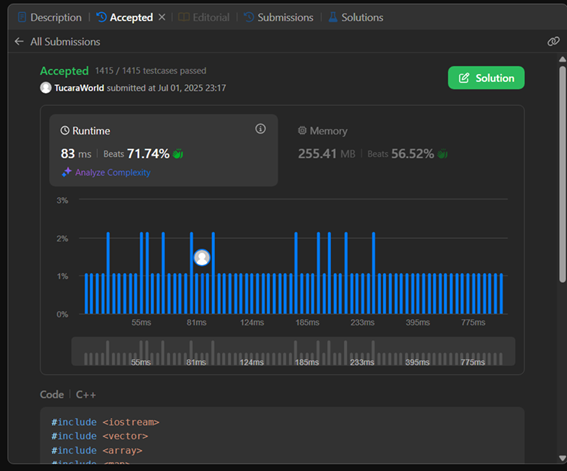

<p align="center">
  
</p>

<h2 align="center">INFORME DEL TRABAJO FINAL</h2>
<h2 align="center">(ABET)</h2>

<h3 align="center">CURSO DE FUNDAMENTOS DE PROGRAMACIÓN COMPETITIVA – CC217</h3>
<h4 align="center">Carrera de Ciencias de la Computación</h4>

<p align="center"><strong>Sección:</strong> 271</p>


<h4 align="center">Alumno:</h4>

<p align="center">
  • Felices Vallejos, Aaron Alvaro <br/>
  • Ibarra Cabrera, Camila Adriana <br/>
  • Rojas Sánchez, Patricia Lucía del Rosario
</p>

<br/>

<p align="center"><strong>Julio 2025</strong></p>
<p style="page-break-after: always;"></p>

---

<h2 align="center"> CONTENIDO</h2>

## 1. Introducción

### 1.1 Contexto, objetivo, métodos, conclusiones

En el entorno actual de formación en Ciencias de la Computación, es fundamental que los estudiantes comprendan los conceptos teóricos y sean capaces de aplicarlos en la resolución de problemas reales. La programación competitiva representa un espacio ideal para desarrollar y poner a prueba estas habilidades, ya que plantea desafíos que exigen pensamiento lógico, dominio de estructuras de datos y eficiencia algorítmica. Dentro de este marco, el curso de *Fundamentos de Programación Competitiva* propuso como trabajo final resolver 15 problemas seleccionados de plataformas reconocidas como **LeetCode**, **Codeforces** o **Hackerrank**, con el objetivo de consolidar los aprendizajes adquiridos durante el ciclo.

El objetivo del trabajo fue **diseñar, implementar y evaluar** soluciones computacionales que respondan a requerimientos específicos, alineadas al *Student Outcome 2* del enfoque **ABET**, el cual promueve la capacidad de aplicar el conocimiento técnico en la solución de problemas reales en sistemas de información.

Para lograrlo, se aplicaron distintos métodos y técnicas abordadas durante el curso, como el uso de estructuras como `Segment Tree`, `Trie`, `Map` y algoritmos como `KMP`, `Z` y **programación dinámica**. Cada ejercicio fue documentado con su enunciado, código, validación de resultados y explicación detallada del enfoque adoptado.

Como resultado, se logró consolidar el dominio de herramientas fundamentales para el desarrollo de soluciones algorítmicas eficientes. Además, se fortaleció el razonamiento lógico y cuantitativo de los integrantes del equipo, contribuyendo al desarrollo de competencias clave en su formación profesional.

---

## 2. Objetivo del estudiante

### 2.1 Objetivos

- Aplicar los conocimientos adquiridos durante el curso para resolver problemas de programación competitiva que impliquen el uso de estructuras de datos avanzadas y algoritmos eficientes.  
- Diseñar, implementar y evaluar soluciones computacionales frente a problemas con restricciones reales, en línea con el *Student Outcome 2* del enfoque ABET.  
- Fortalecer la capacidad de análisis, resolución de problemas y toma de decisiones basadas en información cuantitativa, mediante la resolución de casos de nivel *medium* y *hard*.  
- Documentar de forma clara y estructurada el desarrollo de cada algoritmo, explicando su lógica, ejecución y validación, para fomentar una comunicación técnica efectiva.

### 2.2 ¿Cómo se logró el objetivo según el *Student Outcome*?

El trabajo final permitió aplicar de manera directa el *Student Outcome 2*, que establece la capacidad de diseñar, implementar y evaluar soluciones computacionales que cumplan requerimientos en contextos reales.

Para ello, se seleccionaron 15 problemas de dificultad *medium* y *hard* extraídos de plataformas reconocidas como **LeetCode** y **Codeforces**. Cada problema fue analizado a partir de sus restricciones, lo que permitió definir una estrategia de solución adecuada y seleccionar las estructuras de datos o algoritmos más eficientes. Esta etapa corresponde al proceso de **diseño**.

Luego, se procedió a la **implementación** en C++, asegurando el cumplimiento de las condiciones del problema y la correcta ejecución del código en las plataformas correspondientes.  

Finalmente, se llevó a cabo una **evaluación** crítica de cada solución, validando resultados y explicando el porqué de las decisiones tomadas, además de justificar la eficiencia y pertinencia del enfoque elegido. Todo esto fue documentado de forma detallada en el informe.

Gracias a este proceso, se desarrollaron competencias alineadas al *Student Outcome 2*, fortaleciendo la capacidad del equipo para enfrentar retos computacionales complejos con un enfoque estructurado, analítico y eficiente.

---

## 3. Plan de actividades

### 3.1 Actividades para construir los algoritmos

Para cumplir con los objetivos del trabajo final, se siguió una planificación estructurada que permitió avanzar de manera organizada en la resolución de los 15 problemas propuestos. A continuación, se describen las principales actividades realizadas:

- **Selección de problemas:** Se eligieron problemas de nivel *medium* y *hard* de plataformas reconocidas como LeetCode, Codeforces, Hackerrank y GeeksforGeeks, asegurando que cubrieran los tipos de algoritmos definidos por el curso (Map, KMP, Z, Segment Tree, Árbol Fenwick, Árboles Ternarios, Trie y Programación Dinámica).

- **Análisis del enunciado y restricciones:** Para cada problema, se realizó un análisis detallado de los requerimientos y condiciones del enunciado. Esto permitió identificar patrones y definir el enfoque más adecuado para su resolución.

- **Diseño de la solución algorítmica:** Se evaluaron diferentes técnicas posibles para cada caso, eligiendo la que ofreciera un mejor balance entre simplicidad, eficiencia y claridad. En esta etapa se definió la estructura general del código y se diseñaron posibles casos de prueba.

- **Implementación en C++:** Se desarrolló el código utilizando buenas prácticas de programación, haciendo uso de estructuras como vectores, mapas y árboles.

- **Validación en plataforma:** Las soluciones fueron probadas en las plataformas respectivas para verificar su corrección, eficiencia y cumplimiento de las restricciones de tiempo y memoria.

- **Documentación de resultados:** Para cada problema se registraron el enunciado, el código fuente, los datos de entrada y salida, una explicación detallada del algoritmo utilizado y capturas de pantalla que demuestran su validación.

- **Revisión final y ajustes:** Se revisó el trabajo completo, tanto en su forma como en el contenido, realizando correcciones y mejoras para asegurar la coherencia, claridad y calidad del informe.

Esta secuencia de actividades permitió un desarrollo ordenado y efectivo del trabajo final, cumpliendo con los requerimientos establecidos por el curso y alineándose con los resultados de aprendizaje definidos por el enfoque ABET.

---

## 4. Desarrollo

### 4.1 Ejercicios con estructura `map`

#### 4.1.1 Ejercicio 1 - Map

- **Tipo de algoritmo:** Para la resolución de este ejercicio se utiliza la estructura `map`.  
- **Herramienta web:** El problema pertenece a la plataforma LeetCode
- **Enlace:**  
  https://leetcode.com/problems/maximum-sum-queries/submissions/1683370047/  
- **Enunciado:**  
  Se te dan dos arreglos de enteros indexados desde 0, `nums1` y `nums2`, cada uno de longitud `n`, y un arreglo 2D indexado desde 1 llamado `queries`, donde `queries[i] = [xi, yi]`.

  Para la *i-ésima* consulta, debes encontrar el valor máximo de `nums1[j] + nums2[j]` entre todos los índices `j` (donde `0 ≤ j < n`) que cumplan `nums1[j] ≥ xi` y `nums2[j] ≥ yi`, o devolver `-1` si no existe ningún `j` que cumpla esas condiciones.

  Debes retornar un arreglo `answer`, donde `answer[i]` es la respuesta a la *i-ésima* consulta.

- **Código:**

```cpp
#include <iostream>
#include <vector>
#include <array>
#include <map>
#include <algorithm>
using namespace std;

class Solution {
public:
    vector<int> maximumSumQueries(vector<int>& nums1, vector<int>& nums2, vector<vector<int>>& queries) {
        int n = nums1.size(), m = queries.size();

        vector<array<int, 3>> puntos;
        for (int i = 0; i < n; ++i) {
            puntos.push_back({ nums1[i], nums2[i], nums1[i] + nums2[i] });
        }

        vector<array<int, 3>> consultas;
        for (int i = 0; i < m; ++i) {
            consultas.push_back({ queries[i][0], queries[i][1], i });
        }

        sort(puntos.begin(), puntos.end(), greater<>());
        sort(consultas.begin(), consultas.end(), greater<>());

        map<int, int> mejores;
        vector<int> respuestas(m, -1);
        int pos = 0;

        for (auto& [qx, qy, idx] : consultas) {
            while (pos < n && puntos[pos][0] >= qx) {
                int y = puntos[pos][1];
                int suma = puntos[pos][2];

                auto it = mejores.lower_bound(y);
                if (it != mejores.end() && it->second >= suma) {
                    ++pos;
                    continue;
                }

                mejores[y] = suma;
                ++pos;
            }

            int mejor = -1;
            auto it = mejores.lower_bound(qy);
            while (it != mejores.end()) {
                mejor = max(mejor, it->second);
                ++it;
            }

            respuestas[idx] = mejor;
        }

        return respuestas;
    }
};
```
- **Ingreso y salida de los datos:**
  
  
  - Para `[4, 1]`: el único punto válido es `(4,2)` → `4+2 = 6`  
  - Para `[1, 3]`: el mejor punto es `(1,9)` → `1+9 = 10`  
  - Para `[2, 5]`: el mejor punto es `(2,5)` → `2+5 = 7`  

  Cada resultado representa el mayor `x + y` que cumple las condiciones de la consulta.

- **Verificación del algoritmo y explicación:**

  
  
  El algoritmo recibe dos vectores (`nums1` y `nums2`) y una lista de consultas. Cada consulta busca el valor máximo de `nums1[j] + nums2[j]`, cumpliendo que `nums1[j] ≥ xi` y `nums2[j] ≥ yi`.

  Primero, se combinan los valores de entrada `(x, y, x+y)` en un solo vector de puntos y se ordenan de forma descendente. Las consultas también se ordenan por `x` para facilitar el procesamiento.

  Se utiliza un `map` ordenado para almacenar los mejores puntos (según `y`) que podrían responder futuras consultas. Por cada consulta, se insertan al mapa los puntos válidos y luego se busca, con `lower_bound`, el mejor `x + y` que cumpla con `y ≥ yi`.

  Finalmente, se guarda la mejor suma posible o `-1` si no hay ninguna válida, y se devuelve la lista de respuestas en el orden original de las consultas.

#### 4.1.2 Segundo ejercicio  

### 4.2 Ejercicios con algoritmo KMP

#### 4.2.1 Ejercicio 1 - Algoritmo KMP

- **Tipo de algoritmo:** Para la resolución de este ejercicio se utiliza el algoritmo KMP.  
- **Herramienta web:** El problema pertenece a la plataforma LeetCode.  
- **Enlace:**  
  https://leetcode.com/problems/remove-all-occurrences-of-a-substring/  
- **Enunciado:**  
  Dadas dos cadenas `s` y `part`, realiza la siguiente operación sobre `s` hasta que todas las apariciones de la subcadena `part` sean eliminadas:

  Encuentra la primera aparición (más a la izquierda) de la subcadena `part` y elimínala de `s`.

  Devuelve `s` después de haber eliminado todas las apariciones de `part`.

  Una subcadena es una secuencia continua de caracteres dentro de una cadena.

- **Código:**

```cpp
#include <vector>
#include <iostream>
using namespace std;

class Solution {
public:
    void getLPSArray(string& part, vector<int>& lps) {
        int len = 0, i = 1;
        lps[0] = 0;

        while (i < part.size()) {
            if (part[i] == part[len]) {
                len++;
                lps[i] = len;
                i++;
            } else {
                if (len != 0)
                    len = lps[len - 1];
                else {
                    lps[i] = 0;
                    i++;
                }
            }
        }
    }

    int KMPSearch(string& s, string& part, vector<int>& lps) {
        int i = 0, j = 0;
        while (i < s.size()) {
            if (s[i] == part[j]) {
                i++; j++;
            }

            if (j == part.size())
                return i - j;

            else if (i < s.size() && s[i] != part[j]) {
                if (j != 0) j = lps[j - 1];
                else i++;
            }
        }
        return -1;
    }

    string removeOccurrences(string s, string part) {
        vector<int> lps(part.size());
        getLPSArray(part, lps);

        while (true) {
            int pos = KMPSearch(s, part, lps);
            if (pos == -1) break;
            s.erase(pos, part.size());
        }

        return s;
    }
};
```
- **Ingreso y salida de los datos:**

  
  
  Para la entrada `s = "daabcbaabcbc"` y `part = "abc"`, se eliminan todas las apariciones de `"abc"` de izquierda a derecha.

  El proceso paso a paso es:
  - `"daabcbaabcbc"` → `"dabaabcbc"`
  - `"dabaabcbc"` → `"dababc"`
  - `"dababc"` → `"dab"`

  El resultado final es `"dab"`, ya que no quedan más ocurrencias de `"abc"`.

- **Verificación del algoritmo y explicación:**

  
  
  El algoritmo recibe dos cadenas: `s` (texto) y `part` (patrón a eliminar). El objetivo es eliminar todas las apariciones de `part` dentro de `s`, de forma eficiente.

  Primero, se construye un arreglo `lps` (*longest prefix suffix*) que permite optimizar la búsqueda de coincidencias parciales en el patrón. Este paso evita comparar caracteres repetidos innecesariamente.

  Luego, usando el algoritmo **KMP**, se busca la primera aparición del patrón en la cadena. Si se encuentra, se elimina y el proceso se repite desde el inicio.

  La búsqueda se repite hasta que no quedan más ocurrencias del patrón. Finalmente, se retorna la cadena modificada sin las apariciones de `part`.


#### 4.2.2 Segundo ejercicio  

### 4.3 Ejercicios con algoritmo Z

#### 4.3.1 Primer ejercicio  
#### 4.3.2 Segundo ejercicio  

### 4.4 Ejercicios con Segment Tree

#### 4.4.1 Ejercicio 1 – Segment Tree

- **Tipo de algoritmo:** Para la resolución de este ejercicio se utiliza la estructura `Segment Tree`.  
- **Herramienta web:** El problema pertenece a la plataforma LeetCode  
- **Enlace:**  
  https://leetcode.com/problems/range-sum-query-mutable/description/?envType=problem-list-v2&envId=segment-tree  

- **Enunciado:**  
  Dado un arreglo de enteros `nums`, se deben manejar múltiples consultas de los siguientes tipos:
  - Actualizar el valor de un elemento en `nums`.
  - Calcular la suma de los elementos de `nums` entre los índices `left` y `right` (ambos inclusive), donde `left <= right`.

  Se debe implementar la clase `NumArray` con las siguientes funciones:
  - `NumArray(int[] nums)`: Inicializa el objeto con el arreglo de enteros `nums`.
  - `void update(int index, int val)`: Actualiza el valor de `nums[index]` por `val`.
  - `int sumRange(int left, int right)`: Devuelve la suma de los elementos entre los índices `left` y `right`, inclusive.

- **Código:**

```cpp
#include <iostream>
#include <vector>
using namespace std;

class SegmentTree {
public:
    int n;
    vector<int> tree;

    SegmentTree(int size) {
        n = size;
        tree.assign(4 * n, 0);
    }

    void build(vector<int>& arr, int node = 1, int l = 0, int r = -1) {
        if (r == -1) r = n - 1;
        if (l == r) {
            tree[node] = arr[l];
        } else {
            int mid = (l + r) / 2;
            build(arr, 2 * node, l, mid);
            build(arr, 2 * node + 1, mid + 1, r);
            tree[node] = tree[2 * node] + tree[2 * node + 1];
        }
    }

    void update(int idx, int newValue, int node = 1, int l = 0, int r = -1) {
        if (r == -1) r = n - 1;
        if (l == r) {
            tree[node] = newValue;
        } else {
            int mid = (l + r) / 2;
            if (idx <= mid) {
                update(idx, newValue, 2 * node, l, mid);
            } else {
                update(idx, newValue, 2 * node + 1, mid + 1, r);
            }
            tree[node] = tree[2 * node] + tree[2 * node + 1];
        }
    }

    int query(int ql, int qr, int node = 1, int l = 0, int r = -1) {
        if (r == -1) r = n - 1;
        if (qr < l || ql > r) return 0;
        if (ql <= l && r <= qr) return tree[node];
        int mid = (l + r) / 2;
        return query(ql, qr, 2 * node, l, mid) + query(ql, qr, 2 * node + 1, mid + 1, r);
    }
};

class NumArray {
private:
    SegmentTree st;
public:
    NumArray(vector<int>& nums) : st(nums.size()) {
        st.build(nums);
    }

    void update(int index, int val) {
        st.update(index, val);
    }

    int sumRange(int left, int right) {
        return st.query(left, right);
    }
};
```
- **Ingreso y salida de los datos:**

  
  
  - `NumArray numArray = new NumArray([1, 3, 5]);`  
    Crea el objeto con el arreglo `[1, 3, 5]`.

  - `numArray.sumRange(0, 2);`  
    Devuelve `1 + 3 + 5 = 9`.

  - `numArray.update(1, 2);`  
    Actualiza `nums[1]` de `3` a `2`, por lo que el arreglo queda como `[1, 2, 5]`.

  - `numArray.sumRange(0, 2);`  
    Devuelve `1 + 2 + 5 = 8`.

- **Verificación del algoritmo y explicación:**

  

  El algoritmo tiene como objetivo permitir consultas eficientes de suma en rangos y actualizaciones de valores sobre un arreglo de enteros. Para lograrlo, se utiliza un **Segment Tree**, el cual divide el arreglo en segmentos y almacena en cada nodo la suma de un subarreglo determinado.

  Primero, se construye el árbol a partir del arreglo original mediante una función recursiva. Esta función divide el rango actual en mitades y almacena en cada nodo la suma de sus dos hijos. De este modo, se construye una representación jerárquica que permite acceder a la suma de cualquier subarreglo sin necesidad de recorrerlo completamente.

  Cuando se actualiza un valor del arreglo, la función de actualización localiza el nodo correspondiente, modifica el valor y propaga los cambios hacia arriba para mantener las sumas actualizadas. Para responder consultas de suma, el árbol es recorrido selectivamente y solo se suman los nodos que están completamente dentro del rango solicitado. Esto permite obtener el resultado en tiempo logarítmico.

  Al encapsular esta lógica dentro de una clase `NumArray`, se implementan los métodos `update` y `sumRange` requeridos por el problema, garantizando eficiencia incluso ante un gran número de operaciones.

#### 4.4.2 Segundo ejercicio  

### 4.5 Ejercicios con Árbol Fenwick

#### 4.4.1 Ejercicio 1 – Fenwick Tree
#### 4.5.2 Segundo ejercicio  

### 4.6 Ejercicios con Árboles Ternarios

#### 4.6.1 Primer ejercicio  

### 4.7 Ejercicios con Trie

#### 4.7.1 Ejercicio 1 - Trie

- **Tipo de algoritmo:** Para la resolución de este ejercicio se utiliza la estructura `Trie`.  
- **Herramienta web:** El problema pertenece a la plataforma LeetCode  
- **Enlace:**  
  https://leetcode.com/problems/concatenated-words/?envType=problem-list-v2&envId=trie  

- **Enunciado:**  
  Dado un arreglo de cadenas de texto `words` (sin duplicados), devuelve todas las palabras concatenadas que hay en la lista `words`.

  Una palabra concatenada se define como una cadena que está compuesta completamente por al menos dos palabras más cortas (no necesariamente distintas) que también están en el arreglo dado.

- **Código:**

```cpp
#include <vector>
#include <map>
#include <string>
#include <algorithm>
using namespace std;

struct TrieNode {
	map<char, TrieNode*> children;
	bool EOW = false;
};

void insert(TrieNode* root, string word) {
	TrieNode* aux = root;
	for (char c : word) {
    	if (!aux->children.count(c)) {
        	aux->children[c] = new TrieNode();
    	}
    	aux = aux->children[c];
	}
	aux->EOW = true;
}

bool isConcatenated(TrieNode* root, string word, int index, int count) {
	TrieNode* aux = root;
	for (int i = index; i < word.size(); ++i) {
    	char c = word[i];
    	if (!aux->children.count(c)) return false;
    	aux = aux->children[c];
    	if (aux->EOW) {
        	if (i == word.size() - 1) return count >= 1;
        	if (isConcatenated(root, word, i + 1, count + 1)) return true;
    	}
	}
	return false;
}

class Solution {
public:
	vector<string> findAllConcatenatedWordsInADict(vector<string>& words) {
    	TrieNode* root = new TrieNode();

    	sort(words.begin(), words.end(), [](string& a, string& b) {
        	return a.size() < b.size();
    	});

    	vector<string> result;
    	for (string word : words) {
        	if (isConcatenated(root, word, 0, 0)) {
            	result.push_back(word);
        	}
        	else {
            	insert(root, word);
        	}
    	}
    	return result;
	}
};
```
- **Ingreso y salida de los datos:**  


En este ejemplo, se identifican como **palabras concatenadas** aquellas que pueden ser formadas completamente uniendo al menos dos palabras más cortas que también están presentes en el arreglo original. Las palabras válidas son:

  - `"catsdogcats"` puede formarse por **"cats" + "dog" + "cats"**.  
  - `"dogcatsdog"` puede formarse por **"dog" + "cats" + "dog"**.  
  - `"ratcatdogcat"` puede formarse por **"rat" + "cat" + "dog" + "cat"**.  

Estas palabras cumplen con la condición de estar compuestas por al menos dos palabras más cortas del mismo arreglo.

- **Verificación del algoritmo y explicación:**  


El algoritmo tiene como objetivo identificar todas las palabras del arreglo que pueden formarse completamente mediante la concatenación de al menos dos palabras más cortas de la misma lista. Para lograrlo de manera eficiente, se utiliza una estructura de tipo **Trie** (árbol de prefijos), que permite insertar y buscar palabras compartiendo prefijos comunes.

  Primero, las palabras se ordenan por longitud creciente. Esto asegura que, al momento de evaluar una palabra, todas las posibles subpalabras que podrían conformarla ya estén insertadas en el Trie. Luego, para cada palabra, se utiliza una función recursiva que explora todas las posibles particiones. Si se logra llegar al final de la palabra habiendo encontrado al menos dos subpalabras válidas en el Trie, entonces se considera una palabra concatenada.

  Si una palabra cumple esta condición, se añade al resultado. Si no, se inserta en el Trie para que pueda ser utilizada por otras palabras más largas. Al finalizar, se retorna la lista con todas las palabras concatenadas encontradas.

#### 4.7.2 Segundo ejercicio  

### 4.8 Ejercicios con Programación Dinámica

#### 4.8.1 Ejercicio 1 - Programación Dinámica
- **Tipo de algoritmo:** Para la resolución de este ejercicio se utiliza programación dinámica  
- **Herramienta web:** El problema pertenece a la plataforma LeetCode  
- **Enlace:**  
  https://leetcode.com/problems/minimum-insertion-steps-to-make-a-string-palindrome/?envType=problem-list-v2&envId=dynamic-programming  
- **Enunciado:**  
  Dado un string `s`, en un solo paso puedes insertar cualquier carácter en cualquier posición de la cadena.

  Devuelve el número mínimo de pasos necesarios para que `s` se convierta en un palíndromo.

  Un palíndromo es una cadena que se lee igual de izquierda a derecha que de derecha a izquierda.

- **Código:**

```cpp
class Solution {
public:
    int minInsertions(string s) {
        int n = s.size();
        string t = s;
        reverse(t.begin(), t.end());

        vector<vector<int>> dp(n + 1, vector<int>(n + 1, 0));

        for (int i = 1; i <= n; ++i) {
            for (int j = 1; j <= n; ++j) {
                if (s[i - 1] == t[j - 1]) {
                    dp[i][j] = dp[i - 1][j - 1] + 1; 
                }
                else {
                    dp[i][j] = max(dp[i - 1][j], dp[i][j - 1]);
                }
            }
        }

        return n - dp[n][n];
    }
};
```
- **Ingreso y salida de los datos:**  

  


Se desea convertir el string `"mbadm"` en un palíndromo insertando la menor cantidad posible de caracteres. Un palíndromo es una cadena que se lee igual de izquierda a derecha que de derecha a izquierda.

  En este caso, con **2 inserciones** se puede obtener un palíndromo.  
Por ejemplo: al insertar `'d'` y `'b'`, se puede formar `"mbdadbm"`, que sí es un palíndromo.

- **Verificación del algoritmo y explicación:**  


El objetivo del algoritmo es encontrar la cantidad mínima de caracteres que deben insertarse en un string `s` para convertirlo en un palíndromo (una palabra que se lee igual al derecho y al revés).

  Para lograrlo, se compara el string original con su versión invertida. La idea es identificar la mayor cantidad de caracteres que ya están en orden simétrico en ambos sentidos. Esto se hace usando una técnica de **programación dinámica**, que permite calcular de forma eficiente cuántos caracteres ya están en posición correcta para formar un palíndromo.

  Se construye una tabla `dp` que guarda, paso a paso, el número máximo de coincidencias entre el string original y su reverso. Estas coincidencias representan las partes del string que no necesitan cambios.       Finalmente, se resta esa cantidad al tamaño total del string, obteniendo así el número mínimo de caracteres que deben insertarse para completar el palíndromo.  


#### 4.8.2 Segundo ejercicio  

---

## 5. Conclusiones

- La resolución de los problemas permitió aplicar de manera práctica los conceptos estudiados en el curso, fortaleciendo las habilidades algorítmicas y el razonamiento lógico del equipo.

- Al enfrentar problemas de nivel *medium* y *hard*, se desarrolló una mayor capacidad para analizar restricciones, elegir estructuras adecuadas y tomar decisiones técnicas eficientes.

- El enfoque del trabajo estuvo alineado al *Student Outcome 2* del enfoque ABET, al integrar las etapas de diseño, implementación y evaluación en cada solución presentada.

- El uso de diversas estructuras de datos y técnicas algorítmicas (como Segment Tree, Trie, Map, KMP, programación dinámica, entre otras) facilitó la resolución efectiva de problemas reales, similares a los que se encuentran en contextos profesionales.

- La documentación clara y detallada de cada ejercicio reforzó la capacidad de comunicar soluciones técnicas, fomentando buenas prácticas en la redacción de informes y la presentación de resultados.

- Esta experiencia también permitió trabajar de forma colaborativa, distribuir tareas y apoyarse mutuamente para completar un proyecto técnico de forma ordenada y con alta calidad.

---

## 6. Anexos

---

## 7. Bibliografía

